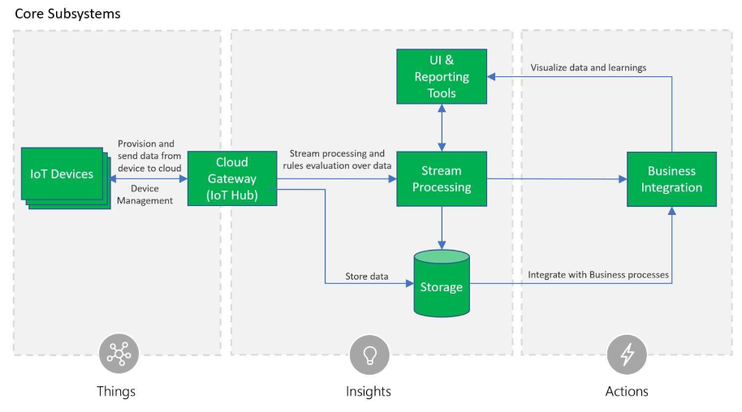

# IoT Courses & Guides

Publicly available courses and guides on IoT technologies

## Microsofty Azure IoT Reference Architecture

A thorough overview of the recommended architecture and implementation technology choices for how to build Azure IoT solutions.

Guide is [available online here](https://azure.microsoft.com/mediahandler/files/resourcefiles/microsoft-azure-iot-reference-architecture/Microsoft_Azure_IoT_Reference_Architecture_2_1_1_update.pdf).

## Microsoft's IoT for Beginners

A 12-week, 24-lesson curriculum all about IoT basics. Each lesson includes pre- and post-lesson quizzes, written instructions to complete the lesson, a solution, an assignment and more.

The projects cover the journey of food from farm to table. This includes farming, logistics, manufacturing, retail and consumer - all popular industry areas for IoT devices.

See [their repository](https://github.com/microsoft/IoT-For-Beginners) for details.

## AWS 

